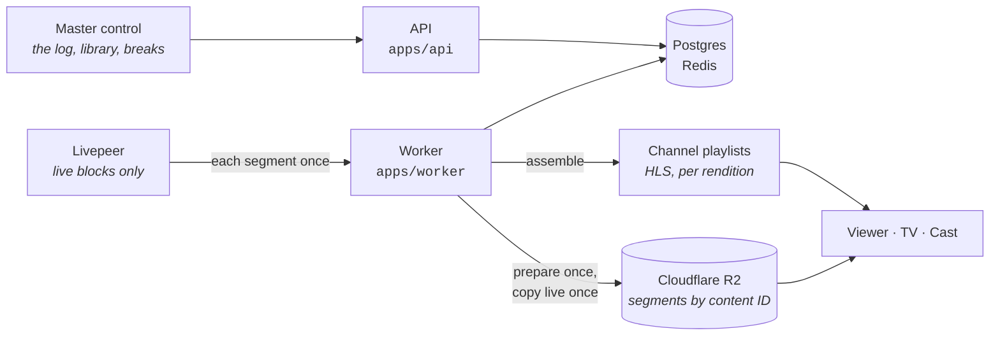
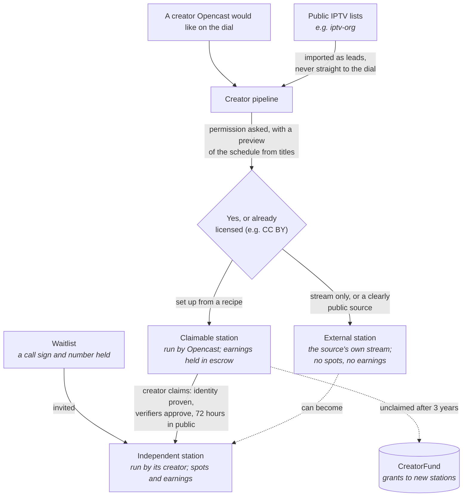
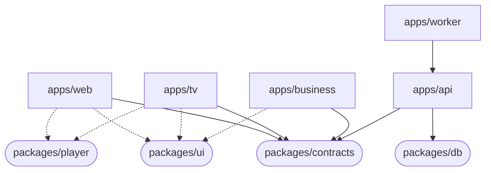
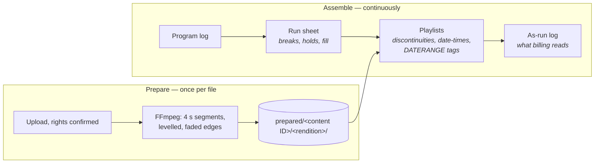
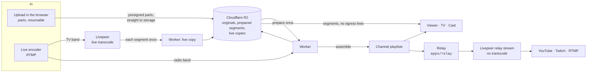
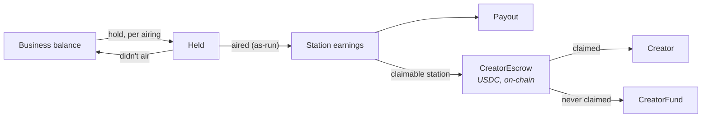

# Opencast

Monorepo for **Opencast** — a dial of 24/7 local stations. Anyone can run a channel: a TV channel
or a radio-band one, with a schedule, breaks, sponsors and a number on the dial. Viewers tune in on
the web, a phone, a TV app or by casting, the way they'd flip channels.

Four web apps, two native wrappers, an API, a playout worker, a relay, and the escrow contracts that
hold a claimable station's earnings until its creator claims them.

[System](#what-the-system-is) · [Layout](#repository-layout) · [Branches](#branches-and-deploys) ·
[Quickstart](#quickstart) · [Playout](#playout) · [Video in and out](#how-video-gets-in-and-out) ·
[Money](#money) · [Apps](#the-apps) ·
[API](#the-api-appsapi) · [Contracts](#the-escrow-contracts-contracts) · [Tests](#tests-and-ci) ·
[Docs](#documentation)

> ⚠️ **Status: pre-launch, staging only.** Everything runs on staging; nothing serves real viewers
> yet. The escrow contracts are **unaudited** and deployed only to a local chain. Interfaces still
> move: contract changes are additive and logged in
> [`docs/contracts-changelog.md`](./docs/contracts-changelog.md).

---

## What the system is

A **station** has a call sign, a channel number in its market (`BEAT 12.1`, `LOFI 99.2`), a library
and a **program log**: the timed schedule of what airs. TV numbers run from 2.1 to 69.9, with
subchannels; the radio band from 88.2 to 107.8 in even tenths, so no number is a real FM station's
(those are all on odd tenths). The worker turns every log into a live
channel, around the clock. Viewers never pick a video; they tune to a number and get whatever is
on.



Three ideas to know before reading the code.

**Prepare once, then assemble.** Prerecorded material is never encoded live. Each file is
transcoded once, into 4-second segments at a fixed ladder, and stored by content ID. A channel is a
rolling HLS playlist that points at those segments in the order the log says. Writing playlists
takes almost no CPU, so a channel costs a few dollars a month, not hundreds. Live blocks are the
only live encode (through Livepeer, for their hours only); the worker copies Livepeer's segments
into R2 once, so viewers play live blocks from R2 too.

**The player draws the graphics.** The station's bug, lower thirds and a spot's code and QR aren't
burned into the picture. The worker writes `#EXT-X-DATERANGE` tags into the playlist
([`packages/contracts/src/hls.ts`](./packages/contracts/src/hls.ts)), and the player draws them.
The same tags carry SCTE-35 cues for every break.

**Off air is a choice; dead air is a mistake.** A station can schedule off air hours or sign off
from its log: its closer airs, then its off-air card, then the playlist ends; it signs back on
with its opener, and the first program starts on time. The dial says when it's back, and nothing
warns. Any other gap in the next 24 hours raises warnings, and the worker fills it from the
library if nobody acts.

### How a station gets on the dial

A number on the dial is held for a waitlist reservation, run by a creator, run by Opencast for a
creator who hasn't joined yet, played from a public source's own stream, or filled by Opencast's
catalog station. Network desk (`/desk`) works the middle of this chart.



- A claimable station's works each point at a permission or licence record; nothing is copied from
  a creator's source before one exists. Its earnings can only go to the verified creator or, after
  the unclaimed period, to the fund. There is no code path that sends them to Opencast.
- A held channel can't be given to any other station, and every kind of station follows the same
  channel number and call sign rules.

---

## Repository layout

npm workspaces + Turborepo. Each app under `apps/` builds on its own.

```
apps/
  web/        the Opencast app       @opencast/web       Vite + React; viewer, /control, /desk
  tv/         TV mode + Cast         @opencast/tv        Vite + React; also receiver.html
  business/   Opencast for business  @opencast/business  Vite + React
  site/       marketing site         @opencast/site      Vite + React
  gallery/    component gallery      @opencast/gallery   every ui component, beside its frame
  api/        the API                @opencast/api       Express, Postgres, Redis
  worker/     playout                @opencast/worker    prepares, assembles; radio live ingest
  relay/      translators            @opencast/relay     one stream per station to YouTube, Twitch, RTMP
packages/
  contracts/  Zod request/response schemas and the HLS tag spec — the API's public surface
  db/         Drizzle schema, SQL migrations, the seed
  domain/     types and pure rules shared by the API and worker
  ui/         design system: tokens, primitives, broadcast components, shells
  player/     the one player: live HLS, channel changes, overlays, the banner, inputs
contracts/    CreatorEscrow and CreatorFund (Foundry) — not a workspace
e2e/          Playwright, on the mocks and against a real API
docs/         architecture, schema, API reference, deploy, the build prompts and reference designs
```

**`packages/contracts` is the seam.** The API is built from it, the apps read it, and the apps
never edit it. Every change is additive and goes in the changelog; what an app needs that isn't
there goes in [`docs/contract-requests.md`](./docs/contract-requests.md).



`domain` and `contracts` build to `dist/`, because the API and worker import their JavaScript at
runtime. `ui` and `player` are source-only; Vite compiles them into each app.

---

## Branches and deploys

| Branch | What it is | Deploys to |
|---|---|---|
| `dev` | day-to-day work | CI only |
| `staging` | what's on staging | Railway `staging` and the Vercel apps |
| `main` | production | Railway `production` (not live yet) |

Work lands on `dev`, moves to `staging` by fast-forward or pull request, and reaches `main` only by
pull request. Never force-push `staging` or `main`.

| Target | Root | Host |
|---|---|---|
| The Opencast app | `apps/web` | Vercel — [opencast-web.vercel.app](https://opencast-web.vercel.app) |
| Opencast for business | `apps/business` | Vercel — [opencast-business.vercel.app](https://opencast-business.vercel.app) |
| TV mode | `apps/tv` | Vercel — [opencast-tv.vercel.app](https://opencast-tv.vercel.app) |
| Site | `apps/site` | Vercel — [opencast-site.vercel.app](https://opencast-site.vercel.app) |
| API, worker, relay, Postgres, Redis | `apps/api`, `apps/worker`, `apps/relay` | Railway project `opencast` |
| Uploads and prepared segments | | Cloudflare R2: `opencast-staging`, `opencast-production` |
| iPhone, Android, Android TV / Fire TV | `apps/web/ios`, `apps/web/android`, `apps/tv/android` | Capacitor 8; nothing submitted yet |

Everything Railway runs is defined in [`.railway/railway.ts`](./.railway/railway.ts) and applied
with `railway config plan`, then `railway config apply`. Secrets are set in Railway and never
written in the repo. Variables, the cutover checklist and the costs are in
[`docs/deploy.md`](./docs/deploy.md).

---

## Quickstart

Requires **Node 22** (Vite 7 won't start on older), npm 10+, Docker, and `ffmpeg` / `ffprobe` on
`PATH`.

```bash
npm install
cp .env.example .env
npm run db:up        # Postgres on :54329, Redis on :63799
npm run db:migrate
npm run db:seed      # markets (the Inland Empire's ZIP codes) and Opencast's network stations (RETRO 4.1, LOFI 99.2, BEAT 94.2)
npm run dev
```

`npm run dev` runs the API on http://localhost:8787, the worker, and the Opencast app on
http://localhost:5173: the viewer at `/`, master control at `/control`, Network desk at `/desk`.

Every app also runs on **mock data** with no backend, answered by Mock Service Worker and checked
against the contracts:

```bash
npm run dev:mock -w @opencast/web        # http://localhost:5174
npm run dev:mock -w @opencast/tv         # http://localhost:5175
npm run dev:mock -w @opencast/business   # http://localhost:5181
npm run dev:mock -w @opencast/site       # http://localhost:5183
npm run mock:streams -w @opencast/player # the mock stations' HLS, once
```

| Script | Does |
|---|---|
| `npm run build`, `typecheck`, `lint`, `test` | every workspace, through Turborepo |
| `npm run db:up`, `db:down` | Postgres and Redis in Docker |
| `npm run db:migrate`, `db:reset`, `db:generate` | apply migrations; drop and re-apply (local only); write one after a schema edit |
| `npm run docs:api` | regenerate [`docs/api.md`](./docs/api.md) from the contracts |
| `npm run e2e:quick` | the mock Playwright flows, without the accessibility specs |
| `npm run e2e:real` | Playwright against a real API and a throwaway database |
| `npm run contracts:test` | the Foundry suite |
| `npm run env:check` | which variables are set, and which are missing |

---

## Playout

The worker (`apps/api/src/v1/modules/playout/engine/`, run by `apps/worker`) does three jobs, under
a Redis leader lock so only one replica airs stations.



- **The ladder.** TV: 1080p, 720p, 480p and 360p, plus audio-only. Radio band: AAC at 128 and
  64 kbps. Spots, bumpers, station IDs and generated underwriting credits are prepared the same way.
- **Breaks** come from the station's break rule and always contain a station ID. Each spot placed
  makes a hold on the advertiser's balance; one without a hold is skipped for the next in rotation.
- **Live blocks** point the playlist at live segments in R2 for their hours, and back. On the TV
  band the worker's leader pulls each new segment of each of Livepeer's renditions once and stores
  it (`prepared/live-<source>-<session>/`, kept two days with the channel's rows), so viewers and
  relays never fetch from Livepeer, a live hour costs the same whatever the audience, and pause and
  rewind work through a live block. On the radio band the worker packages the encoder's push itself.
- **Translators** simulcast a station to YouTube, Twitch or any RTMP address. By default only its
  live shows go out; "Everything I air" runs one sender per station in `apps/relay`, which
  re-encodes only to draw the station's bug. More in [`docs/relay.md`](./docs/relay.md).
- **Readiness.** Every hour the worker checks the next 48 hours: an item not prepared an hour before
  it airs warns the station and the desk, and airs the usual fill if it's still missing.
- **Day templates and off air hours.** A station builds a day once and repeats it (every day,
  weekdays, a given weekday, once). Days run 6:00 am to 6:00 am, and times snap to segment
  boundaries.
- **Signing off and on** (A242). Off air time airs the station's closer, its off-air card for a
  minute, then nothing (the playlist ends); the opener ends as the first program starts, in place
  of the station ID unless the station wants both. Without its own, automatic ones in its look
  ("12.1 BEAT · Signing off · Back at 6:00 am") and the generated off-air card. Off air too short
  to go dark keeps the channel on (closer, card, opener). A channel that never signs off can open
  each broadcast day with its opener, at the first program boundary after 6:00 am.

To see an evening end to end on the dev database:

```bash
npm run demo:evening -w @opencast/worker
npm run as-run -w @opencast/worker -- <stationId>
```

`curl localhost:8788/health` shows the worker's leader, stations on air, what's prepared or
waiting, readiness, radio live's CPU (`live`) and TV live copying (`liveCopy`: bytes pulled per live
hour, CPU, segments skipped, the delay a copy adds).

---

## How video gets in and out

Every byte of video takes one of these paths. None of them passes through the API server, so the
API only hands out addresses and keeps the records.



- **Uploads** go from the browser to R2 in 16–64 MiB parts, five at a time, and resume after a
  dropped connection or a reload. The API reads the file back once for its content ID, so a file
  already on the platform is stored once. More in [`docs/uploads.md`](./docs/uploads.md).
- **Viewers** fetch segments from R2's public address. R2 doesn't charge for egress, so a viewer-hour
  costs a small fraction of a cent. Live blocks too: the worker copies each of Livepeer's segments
  into R2 once as it's published, so no viewer is Livepeer delivery.
- **Relays** push one stream per station to Livepeer, which sends it on to each platform untouched.
  Platform keys are sealed with AES-256-GCM (`PLATFORM_SECRETS_KEY`); see
  [`docs/platforms.md`](./docs/platforms.md).

---

## Money

Every cent goes through a double-entry ledger in the API (`apps/api/src/v1/modules/ledger`), in
micro-dollars. Billing reads the as-run log, never the planned one.



- **Spots** are bought from a business's balance: a hold per placed airing, settled when it airs,
  released when it doesn't. An airing that already has a hold always airs.
- **Sponsorships** and **underwriting** are monthly; the credits are generated slates, never
  uploads.
- **Claimable stations** are ones Opencast sets up for a creator who hasn't joined. What they earn
  goes to the escrow weekly and is paid out when the creator claims the station.
- **Pay-as-you-go.** Being on air is free. A station pays for storage, relays of everything it airs
  and live hours, measured daily and billed monthly: from earnings first, then its card or Clear
  wallet, with caps and a 14-day grace period that never takes the channel off air. The price sheet,
  every number for review, is in [`docs/pricing.md`](./docs/pricing.md).
- **Payments** run through a provider switch (`PAYMENTS_PROVIDER`): a fake on staging, Clear or
  Stripe in production. A live Stripe key outside production is refused. Setup is in
  [`docs/stripe.md`](./docs/stripe.md).

A worked week of every entry is in [`docs/phase-6-sample-week.md`](./docs/phase-6-sample-week.md),
generated by a test.

---

## The apps

| App | Who it's for | What's in it |
|---|---|---|
| **The Opencast app** (`apps/web`) | viewers and creators, one sign-in | The viewer at `/`: the dial, tuned in, the guide, station and program pages, search, the radio band, presets, pledges, You. Master control at `/control`: sign on, the Monitor, the log, live sources, the library, breaks, the spot and syndication markets, sponsors, audience, earnings, translators. Network desk at `/desk` for the Opencast team. A PWA; the phone apps wrap it |
| **TV mode** (`apps/tv`) | the living room | Watching with the banner, number entry, the guide, presets, radio, first launch with a sign-in code, settings. The same build is the Cast receiver and the iPhone's second screen |
| **Opencast for business** (`apps/business`) | advertisers and sponsors | The balance, spots and where they aired, codes at the counter, sponsorships, spots made to order |
| **Site** (`apps/site`) | everyone else | The marketing site, the tuner and the waitlist |

Screens are built from the reference designs in [`docs/reference/`](./docs/reference/), one folder
per app. Copy is final; new words wait in [`docs/apps/new-copy.md`](./docs/apps/new-copy.md) and
open questions in [`docs/apps/open-questions.md`](./docs/apps/open-questions.md).

Sign-in is **Privy**, with Opencast's own Privy app (the API refuses to start with Clear's).

**Watch data.** Every airing records watch time, the audience at its start, peak and end, tune-aways
by the minute and "Not for me" votes. Per-session events are deleted after 30 days, leaving only
per-airing totals, so no viewer can be identified. A program's numbers show only once an airing
reached 20 viewers. Stations see theirs on the Audience page; makers see totals across the stations
that carried them.

---

## The API (`apps/api`)

Express, Postgres (Drizzle; rules enforced by triggers) and Redis. `/v1` is built from
`packages/contracts`: 351 endpoints in 22 modules, listed in [`docs/api.md`](./docs/api.md). How
it's put together — modules, roles, events, how money moves — is in
[`docs/architecture.md`](./docs/architecture.md), and the schema in
[`docs/schema.md`](./docs/schema.md).

```text
GET /health
```

Public reads (the dial, guide, station pages, heartbeats) need no sign-in. Everything else needs a
Privy token and a role on the station, business or desk it touches.

---

## The escrow contracts (`contracts/`)

`CreatorEscrow` holds a claimable station's earnings in USDC until its creator claims it.
`CreatorFund` backs new stations and programs with what's never claimed. Both are UUPS proxies on
OpenZeppelin 5, administered through a 7-day timelock that any verifier or steward can cancel.

```bash
npm run contracts:test
```

Deployment, roles and the upgrade path are in [`contracts/README.md`](./contracts/README.md).

---

## Tests and CI

| Suite | Run |
|---|---|
| Unit (every app and package) | `npm test`, or `npm test -w @opencast/<name>` |
| API | `npm run test:suite -w @opencast/api` (needs `npm run db:up`); real-time relays: `test:realtime` |
| Playwright on the mocks | `npm run e2e:quick` |
| Playwright against a real API | `npm run e2e:real` |
| Contracts | `npm run contracts:test` |

GitHub Actions ([`.github/workflows/ci.yml`](./.github/workflows/ci.yml)) runs typecheck, builds, unit
tests, the API suite and the mock Playwright flows on every push to `dev` and `staging`, and the
real-API Playwright specs on pull requests. Production builds are checked for mock code. More in
[`docs/apps/testing.md`](./docs/apps/testing.md).

---

## Documentation

| | |
|---|---|
| Architecture | [`docs/architecture.md`](./docs/architecture.md) |
| Schema | [`docs/schema.md`](./docs/schema.md) |
| API reference | [`docs/api.md`](./docs/api.md) (generated) |
| Contracts changelog · requests | [`docs/contracts-changelog.md`](./docs/contracts-changelog.md) · [`docs/contract-requests.md`](./docs/contract-requests.md) |
| Deploying | [`docs/deploy.md`](./docs/deploy.md) |
| Prices · Stripe | [`docs/pricing.md`](./docs/pricing.md) · [`docs/stripe.md`](./docs/stripe.md) |
| Relays · platforms · uploads | [`docs/relay.md`](./docs/relay.md) · [`docs/platforms.md`](./docs/platforms.md) · [`docs/uploads.md`](./docs/uploads.md) |
| Clear integration | [`docs/clear-integration.md`](./docs/clear-integration.md) |
| The apps: inventory, rules, testing, native | [`docs/apps/`](./docs/apps/) |
| Build prompts | [`docs/prompts/`](./docs/prompts/): the platform, apps and follow-up prompts; where the code stood against them is in [`docs/catch-up-report.md`](./docs/catch-up-report.md) |
| Reference designs | [`docs/reference/`](./docs/reference/) |
| Open decisions | [`docs/open-decisions.md`](./docs/open-decisions.md) |

---

## Security

- Secrets live in Railway, Vercel and the ignored `.env`; never in the repo. Rotate anything that
  has been pasted anywhere else
- Signed-in endpoints check the Privy token and the caller's role on every request
- Platform stream keys and tokens are stored sealed (AES-256-GCM) and never sent back to an app
- Money only moves through the ledger, and billing reads only the as-run log
- The escrow contracts are **unaudited**; don't deploy them to a real network before a review

---

## Contributing

Focused pull requests against `dev`. Run the suites that cover what you touched, keep contract
changes additive (and in the changelog), and update the docs when an interface or workflow moves.
